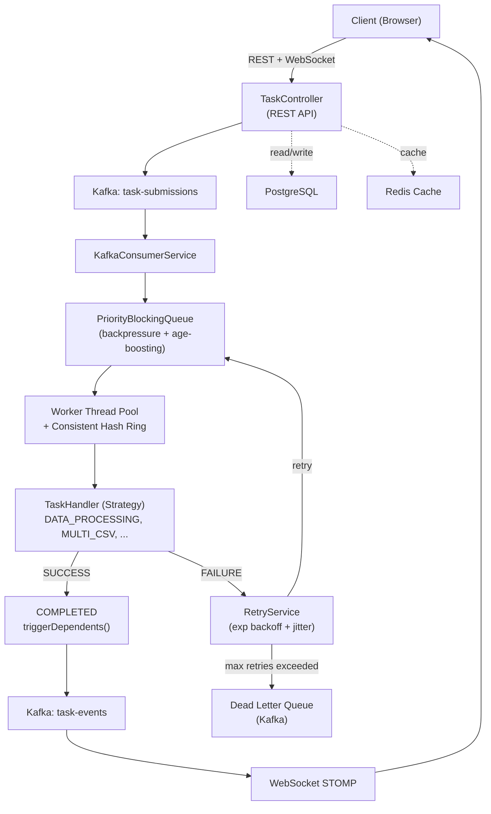
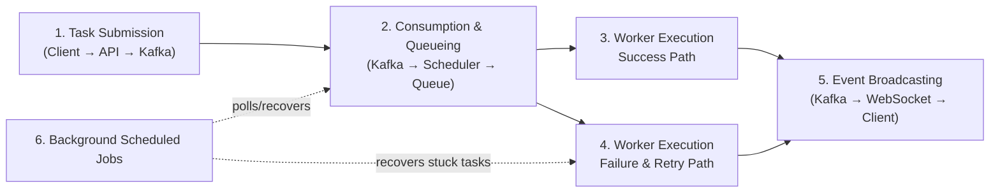
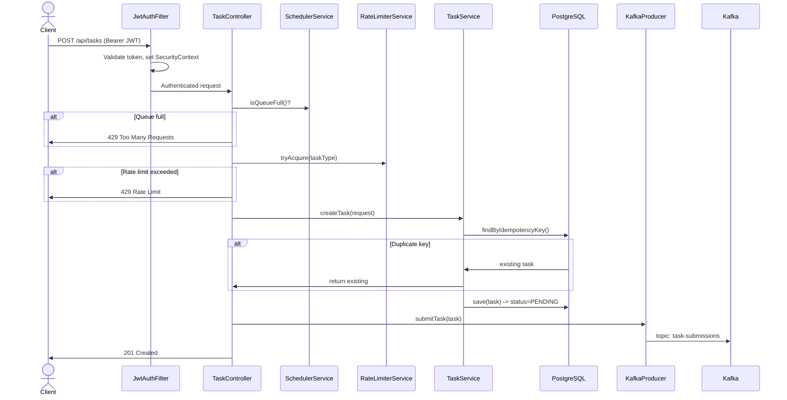
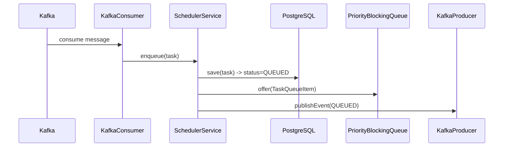
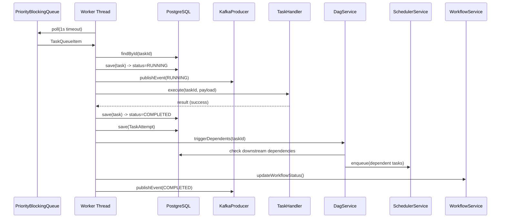
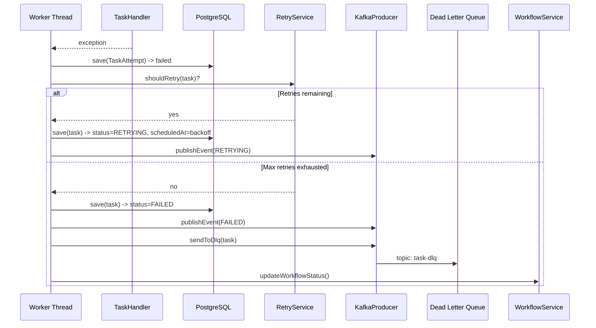
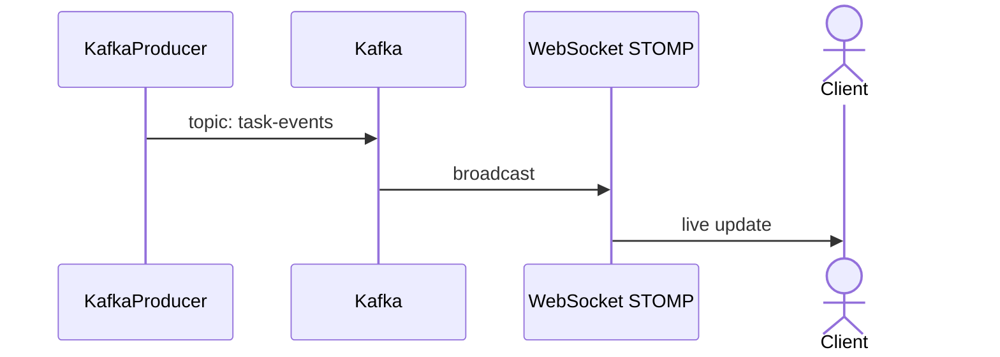
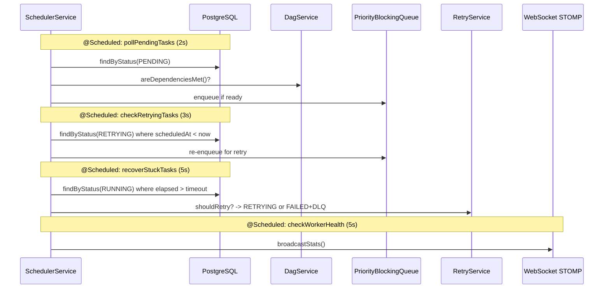

# Distributed Task Scheduler

A multi-threaded job scheduling system that demonstrates core **distributed systems**, **OS concurrency**, and **software engineering** patterns - built with Spring Boot, Apache Kafka, and a real-time WebSocket dashboard.

**What** - A task scheduler that accepts jobs via REST API, queues them by priority, dispatches to a thread pool of workers, handles failures with retries and circuit breakers, and orchestrates multi-step workflows via DAG dependencies.

**Why** - To implement and showcase production-grade patterns (consistent hashing, backpressure, graceful shutdown, idempotency, starvation prevention, exponential backoff) in a single, runnable project.

**How** - Tasks flow through: `REST API -> Kafka -> PriorityBlockingQueue -> Worker Threads -> TaskHandler`. Results stream back to the browser via WebSocket (STOMP).

---

## Tech Stack

| Layer | Technology |
|---|---|
| **Backend** | Java 21, Spring Boot 3.2, Spring Data JPA |
| **Messaging** | Apache Kafka (3 topics: submissions, events, DLQ) |
| **Database** | PostgreSQL + Flyway migrations |
| **Caching** | Redis (Spring cache abstraction and districbuted locks) |
| **WebSocket** | STOMP over SockJS |
| **Metrics** | Micrometer + Prometheus + grafana dashboard |
| **Frontend** | Vanilla JS, Chart.js, HTML5 Canvas |
| **Infra** | Docker Compose (App, Postgres, Redis, Kafka, Prometheus, Grafana, Loki, pgAdmin) |

---

## Architecture



---

## Project Structure

```text
distributed-task-scheduler/
├── docker/docker-compose.yml       # Kafka + Zookeeper + Kafka UI
├── data/                           # Sample CSV files for task handlers
├── pom.xml
└── src/main/
    ├── java/com/scheduler/
    │   ├── config/                 # Kafka, WebSocket, Metrics, Wiring configs
    │   ├── controller/TaskController # REST API (tasks, workflows, stats, DAG, hash ring)
    │   ├── dto/                    # Request/Response DTOs, Kafka events
    │   ├── handler/                # TaskHandler interface + implementations
    │   ├── model/                  # JPA entities (Task, Workflow, DLQ, Attempt, Dependency)
    │   ├── repository/             # Spring Data repos + JPA Specifications
    │   └── service/                # Core logic (Scheduler, DAG, HashRing, Retry, RateLimiter)
    └── resources/
        ├── application.yml
        └── static/                 # index.html, app.js, styles.css (dashboard)

```

---

## Code Flow

1. User submits task -> POST `/api/tasks`
2. Backpressure check -> queue full? -> 429
3. Rate limit check -> token bucket empty? -> 429
4. Idempotency check -> duplicate key? -> return existing task
5. `TaskService.createTask()` -> persist to H2
6. `KafkaProducerService` -> publish to `task-submissions`
7. `KafkaConsumerService` -> consume -> `SchedulerService.enqueue()`
8. `PriorityBlockingQueue` -> ordered by priority + age boost
9. Worker thread polls -> `executeTask()`
10. `TaskHandler.execute()` -> real CSV processing / simulation
11. Success -> COMPLETED, trigger DAG dependents
Failure -> `RetryService` (backoff) or DLQ
12. Kafka: task-events -> WebSocket STOMP -> dashboard update
 
---
 
### 0. High-Level Overview
 
How the 6 stages below connect to each other.
 

 
---
 
### 1. Task Submission
 
Client hits the API; auth, capacity checks, rate limiting, and idempotency are all resolved before the task is persisted and handed off to Kafka.
 

 
---
 
### 2. Consumption & Queueing
 
Kafka message is picked up, persisted as QUEUED, and placed on the in-memory priority queue for workers to pick up.
 

 
---
 
### 3. Worker Execution — Success Path
 
A worker pulls a task off the queue, checks the circuit breaker, executes it, and on success triggers any dependent tasks via the DAG.
 

 
---
 
### 4. Worker Execution — Failure & Retry Path
 
Same execution step as above, but the exception branch: retry with backoff, or exhaust retries and route to the dead letter queue.
 

 
---
 
### 5. Event Broadcasting to Dashboard
 
Every status change published to Kafka's `task-events` topic gets relayed to connected clients over STOMP.
 

 
---
 
### 6. Background Scheduled Jobs
 
The four `@Scheduled` jobs that keep the system self-healing: promoting ready tasks, retrying due tasks, recovering stuck tasks, and reporting health.
 



---

## Quick Local Setup

**Prerequisites**: Java 17+, Maven 3.8+, Docker

```bash
# 1. Start Kafka
cd docker && docker-compose up -d

# 2. Build & Run
cd .. && mvn spring-boot:run

# 3. Open dashboard
open http://localhost:8080

```

| Service | URL | Credentials |
| --- | --- | --- |
| Dashboard | `http://localhost:8080` | JWT Required |
| Grafana | `http://localhost:3000` | admin/admin |
| Kafka UI | `http://localhost:9090` | - |
| Prometheus Metrics | `http://localhost:9091` | - |
| pgAdmin | `http://localhost:5050` | admin@scheduler.com/ admin | 

---

## Features

* **Priority scheduling** - 4 levels (CRITICAL -> LOW), FIFO within same priority
* **DAG workflows** - visual canvas builder with dependency arrows, topological sort, live execution viz
* **Real CSV processing** - sort, filter, aggregate on actual CSV files; multi-file join/merge/compare
* **Retry with exponential backoff** - configurable max retries, jitter to avoid thundering herd
* **Consistent hash ring** - 150 virtual nodes per worker, MD5 hashing, minimal redistribution
* **Rate limiting** - token bucket (global + per-type), configurable capacity and refill rate
* **Backpressure** - rejects submissions (HTTP 429) when queue is at capacity
* **Graceful shutdown** - drains queue back to PENDING, waits 30s for workers to finish
* **Idempotency keys** - duplicate task prevention via unique key on submission
* **Starvation prevention** - age-based priority boost (effective priority increases every 10s in queue)
* **Dead Letter Queue** - permanently failed tasks published to Kafka DLQ topic
* **Prometheus metrics** - counters (submitted/completed/failed), timer (execution time), gauges (queue size, workers)
* **JSON payload builder** - visual form with per-type schemas, conditional fields, live preview
* **Server-side filtering & pagination** - JPA Specifications with dynamic query params
* **PostgreSQL + Flyway** - persistent storage with versioned schema migrations
* **Redis caching + locks** - @Cacheable lookups with TTL, distributed lock service
* **Grafana dashboards** - auto-provisioned: task rates, queue/workers, P50/P95/P99 latency, JVM metrics
* **Structured logging** - JSON logs, correlation IDs via MDC, Loki+Promtail aggregation
* **Spring Security + JWT** - stateless auth, RBAC (ADMIN: write, VIEWER: read-only), BCrypt hashing

---

## Algorithms, OS Concepts & Engineering Patterns

### Algorithms

* **Kahn's Algorithm** - BFS topological sort for DAG execution ordering (`DagService`)
* **DFS 3-color cycle detection** - white/grey/black marking to detect circular dependencies
* **Consistent hashing** - MD5 hash ring with virtual nodes and clockwise lookup (`ConsistentHashRing`)
* **Exponential backoff with jitter** - `delay = base * 2^retryCount + random(0, 25%)` (`RetryService`)
* **Token bucket** - rate limiting with burst capacity and steady refill (`RateLimiterService`)

### OS / Concurrency Concepts

* **Producer-Consumer** - REST API produces -> `PriorityBlockingQueue` -> worker threads consume
* **Thread pool** - `ExecutorService` manages worker lifecycle and task dispatch
* **Priority scheduling** - `Comparable`-based ordering in `PriorityBlockingQueue`
* **Starvation prevention** - age-based priority aging so low-priority tasks eventually execute
* **Backpressure** - bounded queue with rejection when full
* **Graceful shutdown** - `@PreDestroy` drains queue, `awaitTermination` for in-flight tasks
* **Heartbeat / Liveness** - `@Scheduled` polling detects offline workers by timestamp
* **Concurrent data structures** - `ConcurrentHashMap`, `ConcurrentSkipListMap`, `PriorityBlockingQueue`, `AtomicInteger`, `AtomicLong`, `volatile`

### Software Engineering Patterns

* **Strategy** - `TaskHandler` interface with pluggable implementations per task type
* **Observer** - WebSocket STOMP broadcasts state changes to all subscribers
* **Factory** - static factory methods (`TaskResponse.from()`, `TaskEvent.of()`, `TaskAttempt.start()`)
* **Idempotency** - unique key deduplication on task creation
* **Event-driven architecture** - Kafka decouples submission, processing, and notification
* **Dead Letter Queue** - poison message isolation for permanently failed tasks
* **DTO pattern** - request/response separation from JPA entities
* **Dependency Injection** - Spring constructor injection; `List<TaskHandler>` auto-collected
